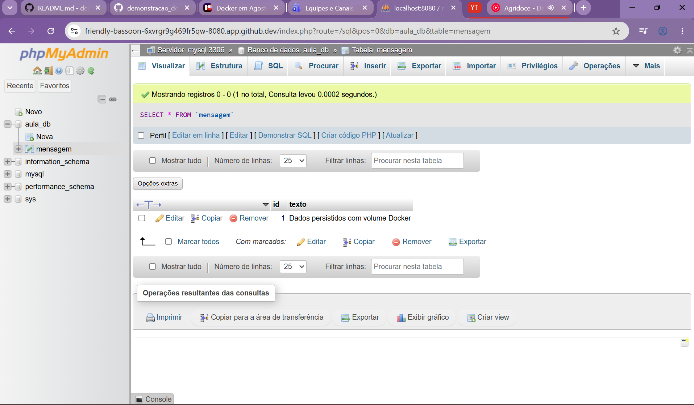

# demonstracao_docker
Repositório da demonstração de Docker

Aula prática - Docker e GitHub Codespaces 

1. Identificação Nome do aluno: 
* Maísa Costa Borges

2. Docker no Codespaces Versão do Docker utilizada: 
* Docker version 29.3.0-1

3. Contêiner Nginx Descreva em 2 ou 3 linhas o que aconteceu ao executar o Nginx.
* O NGIX foi responsável por criar uma imagem já existente que contém os arquivos e as instruções necessárias para executar uma aplicação.

4. Imagem personalizada Informe o nome/tag da imagem criada e o resultado de docker run --rm aula-docker:1.0. 

* Nome/tag da imagem criada: aula-docker:1.0
* Resultado do comando `docker run --rm aula-docker:1.0`:
Olá! Esta imagem Docker foi criada na aula de Integração e Entrega Contínua.

5. Docker Compose Registre o resultado de docker compose ps e confirme o acesso ao phpMyAdmin. 

* NAME              IMAGE               COMMAND                  SERVICE      CREATED          STATUS          PORTS
aula-mysql        mysql:8.4           "docker-entrypoint.s…"   mysql        11 seconds ago   Up 11 seconds   0.0.0.0:3306->3306/tcp, [::]:3306->3306/tcp, 33060/tcp
aula-phpmyadmin   phpmyadmin:latest   "/docker-entrypoint.…"   phpmyadmin   11 seconds ago   Up 10 seconds   0.0.0.0:8080->80/tcp, [::]:8080->80/tcp

6. Persistência Explique por que o registro da tabela mensagem continuou existindo depois de docker compose down e docker compose up -d. 

* Isso está relacionado aos volumes, o volume mysql-data mantém os dados fora do ciclo de vida dos contêineres.

7. Evidências Inclua as evidências solicitadas pelo professor, como capturas de tela ou saídas curtas do terminal.
Evidência 1:
* [+] Running 2/2
 ✔ Container aula-mysql       Started                                                                                0.3s 
 ✔ Container aula-phpmyadmin  Started     

Evidência 2:
* NAME              IMAGE               COMMAND                  SERVICE      CREATED       STATUS          PORTS
aula-mysql        mysql:8.4           "docker-entrypoint.s…"   mysql        2 hours ago   Up 16 seconds   0.0.0.0:3306->3306/tcp, [::]:3306->3306/tcp, 33060/tcp
aula-phpmyadmin   phpmyadmin:latest   "/docker-entrypoint.…"   phpmyadmin   2 hours ago   Up 15 seconds   0.0.0.0:8080->80/tcp, [::]:8080->80/tcp

Evidência 3:
* @M41S4 ➜ /workspaces/demonstracao_docker (main) $ docker run --rm aula-docker:1.0
Olá! Esta imagem Docker foi criada na aula de Integração e Entrega Contínua@M41S4 ➜ /workspaces/demonstracao_docker (main)

Evidência 4:

**Outras perguntas:**
1. Qual é a diferença entre uma imagem Docker e um contêiner?

*A  imagem docker é o que origina o contêiner, contendo as instruções e aplicações para criar o contêiner. Já o contêiner, é a própria instância inicializada.

2. O que significa o mapeamento de portas 8080:80?

* 8080 significa a porta localhost, seria o servidor local, já o 80, corresponde à porta do próprio container Docker

3. Qual é a função do Dockerfile neste exercício?

* O arquivo define uma imagem baseada no Ubuntu, cria o diretório de trabalho /app, copia o arquivo hello.txt para a imagem e define o comando que será executado quando o contêiner iniciar.

4. Por que o serviço phpMyAdmin consegue acessar o MySQL usando PMA_HOST: mysql?

* Pois, graças ao Docker compose, há uma rede interna, o que torna possível esse acesso

5. Qual é a função do volume mysql-data?

* O volume mysql-data garante a persistência dos dados do banco MySQL fora do ciclo de vida dos contêineres.

6. O que aconteceria com os dados se o ambiente fosse encerrado com docker compose down -v

* Dessa forma, o volume seria deletado